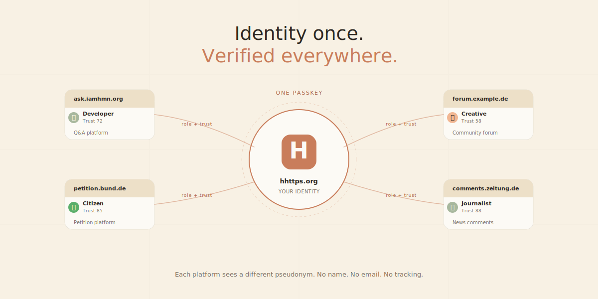
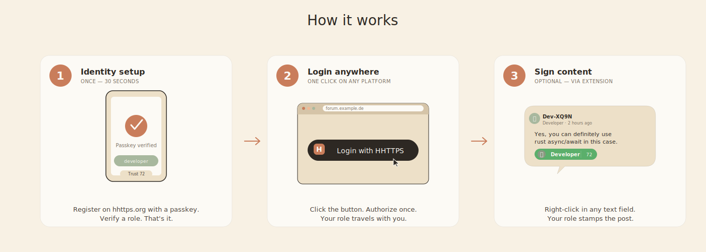
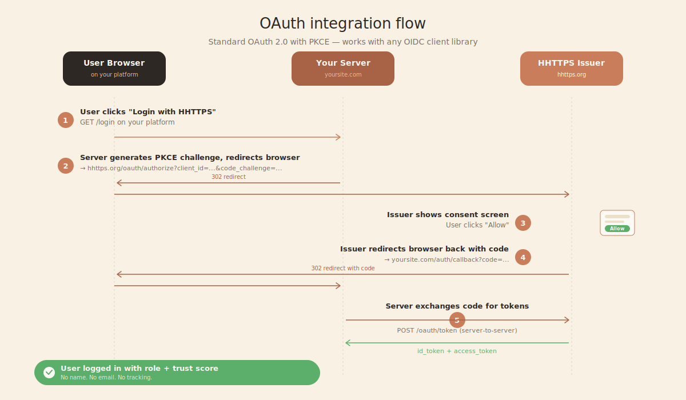

# HHTTPS 🔐

> **The protocol for verifying humans on the internet — without surveillance, without ads, without lock-in.**

[](https://opensource.org/licenses/EUPL-1.2)
[](https://hhttps.org)
[](https://github.com/dhannus/HumanProof)

Live: **[hhttps.org](https://hhttps.org)** · Demo platform: **[ask.iamhmn.org](https://ask.iamhmn.org)** · Brand site: **[iamhmn.org](https://iamhmn.org)**

<!-- IMAGE PLACEHOLDER: hero-screenshot.png
     Wide hero shot (1600×800 recommended): hhttps.org main page on the left
     showing a verified identity, ask.iamhmn.org on the right showing a logged-in
     user with their role badge. Diagonal split or side-by-side.
     Caption: "Identity once. Verified everywhere." -->



---

## What is HHTTPS?

HHTTPS (Human-verified HTTPS) is an open protocol that lets any platform on the internet verify that the person they're talking to is actually a human — without storing or revealing personal data.

It's built around three ideas:

1. **Identity once, log in everywhere.** A user verifies their identity once (via passkey, ORCID, official ID, etc.) on a HHTTPS issuer. From then on, they can log in to any participating platform with a single click — like "Sign in with Google", but with no Google.

2. **Roles, not names.** Platforms don't get your name, email, or browsing history. They get a *role* (e.g. `developer`, `medical_professional`, `journalist`) and a *trust score* (how strongly that role was verified). That's enough for most platforms to make decisions about content, rate limits, and trust — without invading privacy.

3. **Cryptographic signatures for content.** Beyond login, users can sign text messages they post anywhere (forums, comments, emails) with their HHTTPS identity. Other users with the extension see a small inline seal showing "verified human, role X". Bots cannot fake these seals.

The protocol is the successor to HTTPS for the AI age: HTTPS proves "the server is who it claims to be"; HHTTPS proves "the *person* is who they claim to be — but privacy-preservingly."

---

## How it works (in one minute)

<!-- IMAGE PLACEHOLDER: how-it-works.png
     Three-panel illustration showing the user journey:
     Panel 1: User on hhttps.org doing one-time setup (passkey scan)
     Panel 2: User on a third-party platform clicking "Login with HHTTPS"
     Panel 3: User posting a comment with inline verified seal
     Style: pastel illustrations matching iamhmn.org branding -->



**Step 1 — Identity setup (once)**
A user visits a HHTTPS issuer (e.g. hhttps.org), registers a passkey, optionally proves a role (developer via GitHub, journalist via press pass, etc.). The issuer stores the role and a trust score. The user's browser stores the identity locally.

**Step 2 — Logging in (one click, anywhere)**
On any platform that supports HHTTPS, the user clicks "Login with HHTTPS". They're briefly redirected to the issuer, click "Allow", and are back on the platform — now logged in with their role and trust score visible to the platform, but nothing personal.

**Step 3 — Signing content (optional)**
With the browser extension installed, users can right-click in any text field to sign their post. A short marker like `#hhttps:s:hp-7K2-XQ9N` appended to their text becomes a green inline seal for other extension users — showing the author's role and trust without revealing their identity.

---

## What works right now

This is not vaporware. As of May 2026:

| Component | Status | Where to see it |
|---|---|---|
| **HHTTPS Issuer** — production server | ✅ Live | [hhttps.org](https://hhttps.org) |
| **Browser Extension** — Chrome/Firefox | ✅ v1.4.3 | `extension/` in this repo |
| **OAuth 2.0 / OpenID Connect Provider** | ✅ Live | [hhttps.org/.well-known/openid-configuration](https://hhttps.org/.well-known/openid-configuration) |
| **Inline content signatures** with domain binding | ✅ Live | Try the extension on any forum |
| **15-role identity system** with trust scoring | ✅ Live | [hhttps.org/hhttps/roles](https://hhttps.org/hhttps/roles) |
| **Federation registry** for self-hosted issuers | ✅ Spec'd | `docs/federation.md` |
| **ask.iamhmn.org** — Q&A demo platform | ✅ Live | [ask.iamhmn.org](https://ask.iamhmn.org) |

You can:
- Visit [hhttps.org](https://hhttps.org), create an identity in 30 seconds with a passkey
- Visit [ask.iamhmn.org](https://ask.iamhmn.org), click "Login with HHTTPS", post a question
- Install the browser extension from `extension/` and sign any comment on any site
- Run your own HHTTPS issuer using the code in `server/`

---

## A note on privacy: pseudonymous, not anonymous

Honesty matters more than marketing. HHTTPS is **privacy-preserving**, but **not zero-knowledge anonymous** in its current form.

What this means concretely:

| Observer | What they can see |
|---|---|
| **A platform** (e.g. ask.iamhmn.org) | A pairwise pseudonymous ID (e.g. `7K2XQ9NMR3F...`), a role, a trust score. **No** name, **no** email, **no** IP address. |
| **A different platform** | A *different* pseudonymous ID for the same user. Cross-platform tracking is cryptographically impossible. |
| **Two colluding platforms** | They cannot link their IDs together. The pairwise function is one-way per (user, client) pair. |
| **The HHTTPS issuer** (e.g. hhttps.org) | Knows which user has which pseudonyms on which platforms. Knows *that* you logged in, not *what* you did there. |
| **A network observer / bot / hacker** | Sees nothing — there's no public data leakage. |

**The issuer is a trust anchor.** A user who registers on hhttps.org trusts hhttps.org not to misuse the link between their real identity and their pseudonyms. This is the same trust model as eIDAS 2.0 wallets, certificate authorities, or any other federated identity system today.

We chose JWT-based pseudonyms (rather than zero-knowledge proofs) because ZKP tooling is not yet production-ready for civic-tech use. The architecture is designed so that **a future migration to ZKP requires no protocol-level breaking changes** — only the token issuance and verification layer would change. ZKP migration is on the long-term roadmap.

If you need maximum anonymity (e.g. as a whistleblower), HHTTPS in its current form is not the right tool. For most everyday "is this a real human" use cases, the privacy guarantees are stronger than any existing identity system.

---

## Why now

Every month we wait, the gap between human and machine identity grows wider:

- **The EU AI Act is in force** — content must be labeled, but there's no standard tool.
- **eIDAS 2.0 wallets are rolling out** across Europe — but they're heavy-weight ID systems, overkill for "is this a real person".
- **The DSA requires platforms to act on systemic risks** — but provides no infrastructure for them to verify users.
- **Generative AI floods every discourse channel** — democratic conversation, education, mental health support, journalism.

**The window to define this standard is open.** If we don't build it open-source and privacy-first, someone else will build it closed and surveillance-first.

---

## For platform operators: integrate HHTTPS in 10 minutes

If you run a forum, a Q&A site, a comment system, or any platform where you want to verify users are human — adding HHTTPS as a login option takes about 10 minutes.

<!-- IMAGE PLACEHOLDER: integration-flow.png
     Diagram showing: User clicks "Login with HHTTPS" → redirected to issuer →
     consent screen → redirected back with role + trust → platform welcomes user.
     Use the standard OAuth flow visualization with HHTTPS branding. -->



### Minimum integration

```html
<a href="https://hhttps.org/hhttps/oauth/authorize?
        response_type=code&
        client_id=YOUR_CLIENT_ID&
        redirect_uri=https://yoursite.com/auth/callback&
        scope=openid+role&
        state=RANDOM_STRING&
        code_challenge=PKCE_CHALLENGE&
        code_challenge_method=S256">
  Login with HHTTPS
</a>
```

Then handle the callback: exchange the `code` for a token at `/hhttps/oauth/token`, decode the `id_token` to get the user's role and trust score, store the pairwise subject ID as your user identifier.

Full integration guide with code examples for Node.js, Python, PHP, and plain JavaScript: [`docs/oauth-integration.md`](docs/oauth-integration.md).

Working reference implementation: see [`examples/`](examples/) directory in this repo, or look at how [ask.iamhmn.org](https://ask.iamhmn.org) does it (its source is in a separate repo at [github.com/dhannus/ask-iamhmn](https://github.com/dhannus/ask-iamhmn) once published).

### Register your platform

To use HHTTPS as a login provider, your platform needs a `client_id`. For Phase 1 of the rollout, registration is **double opt-in**:

1. Submit a registration request via [hhttps.org/developers](https://hhttps.org/developers) *(coming with Phase 3b)*
2. You receive a verification email
3. The HHTTPS maintainer reviews your platform manually (domain, Impressum, contact)
4. Your platform appears as `verified` to users — green checkmark in the consent screen

Unverified platforms can still use HHTTPS — they just appear with an amber "Unverified platform" warning to users. This is intentional: low friction for getting started, transparent risk signal for end users.

---

## Core principles

| Principle | Description |
|---|---|
| 🔒 **Privacy by design** | No PII shared with platforms. Pairwise pseudonyms prevent cross-platform tracking. |
| ⚖️ **Open standard** | Protocol is public, auditable, EUPL-1.2 licensed. No single company controls it. |
| 🌐 **Federated** | Anyone can run a HHTTPS issuer. Platforms decide which issuers to trust. |
| 🤝 **Inclusive verification** | Multiple verification methods supported — passkey, ORCID, official ID, organizational vouching. No one is locked out. |
| 🛡️ **Transparent trust** | Issuer is honestly documented as a trust anchor. No hand-waving about "zero-knowledge magic". |
| 🌍 **EU-aligned** | Built for GDPR, DSA, EU AI Act, and eIDAS 2.0 interoperability. |
| 🚫 **No ads, no tracking** | The issuer doesn't profile users. No revenue from user data. |

---

## Repository structure

```
hhttps/
├── server/                    # HHTTPS issuer reference implementation
│   ├── server.js              # Express app: identity issuance, OAuth, signatures
│   ├── db.js                  # PostgreSQL data layer
│   ├── public/                # Web UI (login, verify, identity dashboard)
│   ├── sql/                   # Schema + migrations
│   └── scripts/               # Setup helpers
│
├── extension/                 # Browser extension (Chrome/Firefox/Edge)
│   ├── manifest.json          # MV3 manifest
│   ├── background.js          # Service worker
│   ├── content-universal.js   # Inline seal renderer on all sites
│   ├── content-issuer.js      # Identity sync on hhttps.org
│   ├── popup.html / popup.js  # Extension UI
│   └── icons/
│
├── protocol/                  # Protocol specifications
│   ├── identity-token.md      # JWT identity token format
│   ├── signature-format.md    # Inline signature markers (#hhttps:s:slug)
│   ├── oauth-extension.md     # HHTTPS-specific OAuth/OIDC claims
│   ├── federation.md          # How multi-issuer federation works
│   └── roles.md               # The 15-role taxonomy + verification methods
│
├── docs/                      # Human-facing documentation
│   ├── architecture.md        # System architecture
│   ├── threat-model.md        # Security & privacy analysis
│   ├── roadmap.md             # Project roadmap
│   ├── governance.md          # Decision-making process
│   ├── oauth-integration.md   # Step-by-step guide for platform developers
│   ├── user-stories.md        # Original 10 user stories that drove the design
│   └── images/                # Diagrams, screenshots
│
├── examples/                  # Reference integrations
│   ├── express-login/         # Node.js / Express + OAuth login
│   ├── python-flask/          # Python / Flask + OAuth login
│   ├── php-vanilla/           # Plain PHP integration
│   └── browser-only/          # Pure JS, no backend
│
├── sites/                     # Static marketing pages
│   ├── iamhmn.html            # Bürger-facing landing page (DE/EN)
│   └── hhttps-org.html        # Developer/Protocol landing page
│
├── CONTRIBUTING.md
├── SECURITY.md
├── README.md
└── LICENSE                    # EUPL-1.2
```

---

## Quick start

### Try it as a user

1. Open [hhttps.org](https://hhttps.org)
2. Click "Register", set up a passkey (uses your device biometrics)
3. Optionally verify a role (developer → GitHub OAuth, journalist → press card, etc.)
4. Try logging in to [ask.iamhmn.org](https://ask.iamhmn.org) — see your role appear next to your posts
5. Install the [browser extension](extension/) → sign text on any forum or comment site

### Try it as a developer (run your own issuer locally)

```bash
git clone https://github.com/dhannus/HumanProof.git hhttps
cd hhttps/server
bash scripts/install-pg.sh     # sets up local PostgreSQL
npm install
cp .env.example .env           # adjust DB_PASSWORD
npm run dev                    # starts on port 3000
```

Open `http://localhost:3000` — you have your own HHTTPS issuer. Point the browser extension at it by editing `extension/background.js` to use `http://localhost:3000` instead of `https://hhttps.org`.

### Integrate HHTTPS into your platform

See [`docs/oauth-integration.md`](docs/oauth-integration.md) and the working examples in [`examples/`](examples/).

---

## Technical specs (current versions)

### Identity Token (JWT, signed by issuer with ES256)

```json
{
  "iss": "https://hhttps.org",
  "sub": "human-verified",
  "uid": "<opaque-internal-id>",
  "human": true,
  "role": "developer",
  "trustScore": 72,
  "roleLevel": "github-org",
  "ia": 1715000000,
  "exp": 1715003600,
  "jti": "<uuid>"
}
```

Full spec: [`protocol/identity-token.md`](protocol/identity-token.md).

### Content Signature Marker (inline in text)

```
#hhttps:s:hp-7K2-XQ9NMR-3F
```

A short slug that references a server-stored signature record. The record contains the signer's role, trust score, content hash, and domain binding. The marker is short enough for Twitter (28 chars), unlinkable across signatures, and resilient to platform-side text mangling.

Full spec: [`protocol/signature-format.md`](protocol/signature-format.md).

### OAuth/OIDC Extension

HHTTPS extends standard OIDC with three custom scopes:

| Scope | Claims |
|---|---|
| `openid` (required) | pseudonymous `sub`, `iss`, `aud`, standard timestamps |
| `role` | `role`, `role_label`, `role_icon`, `trust_score` |
| `verification_method` | `verification_method`, `verification_method_label` |

Discovery: `https://hhttps.org/.well-known/openid-configuration`

Full spec: [`protocol/oauth-extension.md`](protocol/oauth-extension.md).

---

## Roadmap

| Phase | Timeline | Status | Goal |
|---|---|---|---|
| **1 — Foundation** | 2025 H2 | ✅ Complete | Issuer server, browser extension, identity token spec |
| **2 — Content signatures** | 2026 Q1 | ✅ Complete | Inline seal protocol, domain binding, anti-theft |
| **2.5 — Slug-based signatures** | 2026 Q1 | ✅ Complete | Anti-theft hardening, token-stealing prevention |
| **3a — OAuth Provider** | 2026 Q2 | ✅ Complete (now) | OpenID Connect, ask.iamhmn.org as first client |
| **3b — Developer self-service** | 2026 Q3 | 🟡 Next | Platform registration UI, admin verification flow |
| **3c — Extension OAuth integration** | 2026 Q3 | 🟡 Planned | Auto-consent for trusted platforms, "my logins" UI |
| **3d — SDKs** | 2026 Q3 | 🟡 Planned | JS / Node / Python / PHP libraries |
| **4 — Federation** | 2026 Q4 | 🟡 Planned | Multi-issuer trust registry, community-verified issuers |
| **5 — Public pilot** | 2027 Q1 | 🔵 Future | Partnership with a public-sector platform (city, ministry, election service) |
| **6 — Standard track** | 2027–2028 | 🔵 Future | Submit to IETF / W3C / national standards body |
| **7 — ZKP migration** | 2028+ | 🔵 Vision | Replace JWT identity layer with zero-knowledge proofs when ZKP tooling matures |

Full roadmap with rationale: [`docs/roadmap.md`](docs/roadmap.md).

---

## Frequently asked questions

**Is this surveillance?**
No. Platforms get pseudonymous IDs, roles, and trust scores — no PII. Each platform sees a different pseudonym for the same user. The issuer knows which user has which pseudonyms but doesn't see what users do on platforms.

**What's the trust anchor?**
The HHTTPS issuer. By design. We document this honestly rather than hiding behind cryptographic mystique. ZKP migration in the future will remove this trust requirement.

**Can I run my own HHTTPS issuer?**
Yes — the entire server is open source under EUPL-1.2. See [`docs/architecture.md`](docs/architecture.md) for the operator's guide. Your issuer's users will appear with `unverified issuer` warnings on platforms until either the platform whitelists you or the federation registry includes you.

**What about people without digital ID documents?**
HHTTPS supports multiple verification methods at different trust levels — passkey + email at trust 30, organizational vouching at trust 50, GitHub/ORCID at trust 70, official ID at trust 90+. Even the lowest level provides "this is one person" guarantee, which is enough to defeat bot armies.

**Can AI systems still operate on the internet?**
Yes — they get a parallel **Machine Token** that explicitly identifies them as automated agents. Legitimate bots (crawlers, accessibility tools, moderation systems) are made transparent, not banned. See [`protocol/machine-token.md`](protocol/machine-token.md).

**Is this only for the EU?**
The protocol works anywhere. We start EU-aligned because that's where the legal framework (GDPR, DSA, eIDAS 2.0) is most mature.

**Who is behind this?**
Currently one developer based in Germany, building in the open. Looking for collaborators in: cryptography, policy/law, frontend design, journalism. Email at the bottom of this README.

**Why "HHTTPS" — isn't that confusing with HTTPS?**
That's the point. The protocol is positioned as the next-logical-step after HTTPS:
- HTTP — no security
- HTTPS — proves the server is who it claims to be
- **HHTTPS — proves the *human* on the other end is real, privacy-preservingly**

---

## License

[EUPL-1.2](LICENSE) — the European Union Public Licence. Chosen deliberately: designed for public-sector software, compatible with GPL and AGPL, available in all EU languages.

---

## Contact & community

- **Issues:** [GitHub Issues](https://github.com/dhannus/HumanProof/issues) — bug reports, feature requests, protocol discussions
- **Discussions:** [GitHub Discussions](https://github.com/dhannus/HumanProof/discussions) — open-ended questions, ideas, proposals
- **Email:** [info@iamhmn.org](mailto:info@iamhmn.org)
- **Mastodon:** *coming soon*
- **Matrix:** *coming soon*

---

> *"The internet needs a way to say: a human was here."*
> Built in public. For everyone. Started in Germany. Intended for the world.

---

HHTTPS is an independent open-source project. Not affiliated with any government agency or commercial entity.
