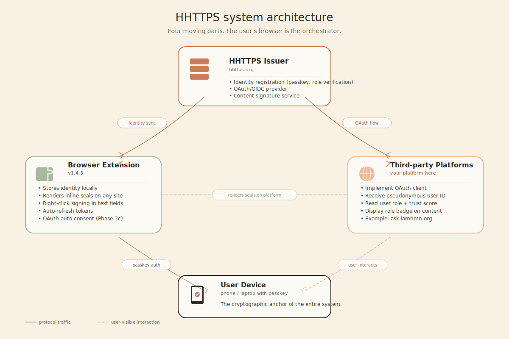

# HHTTPS Architecture

**Last updated**: May 2026

This document describes the architecture of HHTTPS as currently implemented.

---

## System overview

<!-- IMAGE PLACEHOLDER: architecture-overview.png
     System diagram showing the four main components:
     - HHTTPS Issuer (server)
     - Browser Extension
     - Third-party platforms (e.g. ask.iamhmn.org)
     - User's device (passkey/keystore)
     Show data flows: identity issuance, OAuth login, content signing.
     Style: clean, minimal, pastel iamhmn.org branding. -->



HHTTPS has four moving parts:

1. **Issuer Server** — verifies humans, issues identity tokens, hosts OAuth/OIDC endpoints
2. **Browser Extension** — manages the user's identity locally, renders inline seals, signs content
3. **Platform integrations** — third-party sites that consume HHTTPS identity via OAuth
4. **User device** — stores the user's passkey (the actual cryptographic anchor)

The protocol is **client-driven**: the user's browser holds the identity and presents it to platforms. The issuer is consulted only at moments of authentication and verification.

---

## Component: Issuer Server

The reference implementation is in `server/`. Key responsibilities:

### Identity issuance

- WebAuthn registration (passkey creation)
- Role verification via multiple methods (email, OAuth-with-third-parties, document upload, organizational vouching)
- ES256 JWT signing with rotating keys
- JWKS publication at `/.well-known/jwks.json`

### OAuth/OIDC provider

- Authorization code flow with PKCE
- Pairwise subject IDs (HMAC-derived per-platform pseudonyms)
- Discovery document at `/.well-known/openid-configuration`
- User consent screen with platform verification status

### Content signature service

- Signature creation (POST `/hhttps/signatures`)
- Batch verification (POST `/hhttps/signatures/batch`)
- Revocation (POST `/hhttps/signatures/:slug/revoke`)
- Slug-based references with domain binding

### Storage

PostgreSQL with the following key tables:

- `credentials` — WebAuthn passkeys
- `users` — internal user records (pseudonymous)
- `tokens` — issued access tokens (for revocation tracking)
- `refresh_tokens` — long-lived refresh tokens
- `signatures` — content signature records
- `oauth_clients` — registered third-party platforms
- `authorization_codes` — short-lived OAuth codes (60s TTL)
- `connected_platforms` — user → platform connections

### Deployment

Production setup:

- Node.js 20+ on Linux (Debian/Ubuntu)
- PostgreSQL 16+
- Nginx as reverse proxy with Let's Encrypt SSL
- PM2 for process supervision

Setup time on a fresh server: ~30 minutes. See `server/scripts/install-pg.sh` and `server/scripts/deploy.sh`.

---

## Component: Browser Extension

The extension is the user-side runtime. Source in `extension/`.

### Identity management

- Receives identity from the issuer (via `localStorage` on hhttps.org)
- Stores token + refresh token in extension storage
- Auto-refreshes tokens before expiry
- Provides identity to user-initiated actions

### Inline seal rendering

On every web page the extension scans for signature markers (`#hhttps:s:hp-XXX-XXX-XXX`). When found:

1. Marker is extracted from DOM
2. Batched verification request sent to issuer (with current page domain)
3. Marker text is replaced with an inline `<span class="__hhttps-seal__">` showing role icon, label, trust score
4. Click on seal opens detail card with full signature info

Works across same-origin iframes (essential for webmail clients like Strato, Gmail, Outlook Web).

### Context-menu signing

Right-click in any text field → "Sign with HHTTPS" → text is signed via issuer, marker appended.

### OAuth auto-consent

(Planned for Phase 3c) When user lands on an OAuth consent page for a previously-approved platform, the extension can auto-approve without showing the consent screen.

---

## Component: Third-party platforms

Platforms integrate HHTTPS by implementing the OAuth client side. See [`oauth-integration.md`](oauth-integration.md).

Platforms get:

- A `client_id` registered with their issuer of choice
- A redirect URI where users return after consent
- Pseudonymous subject IDs as their primary user identifier
- Role + trust score for each logged-in user

Platforms do NOT get:

- Email, name, IP, location, browsing history
- Cross-platform identity correlation
- Long-term access tokens (they expire in 5 minutes by design)

---

## Data flows

### Identity creation (one-time)

```
User → Browser → Issuer (hhttps.org)
  POST /hhttps/register
    → WebAuthn challenge
  ← challenge

User → Device (passkey scan)
  → Browser: response

Browser → Issuer
  POST /hhttps/register/verify
    → store credential, create user record
  ← initial identity token + role verification options

User selects verification method
  → completes verification flow
  ← verified identity token (with role + trust score)

Browser → localStorage (token stored)
```

### OAuth login on a third-party platform

```
User on platform → click "Login with HHTTPS"

Platform → Browser
  Redirect: hhttps.org/oauth/authorize?client_id=...&redirect_uri=...&pkce_challenge=...

Browser → Issuer (hhttps.org)
  GET /hhttps/oauth/authorize
    → consent page rendered server-side
    → if user is logged in (token in localStorage), consent screen shown
    → if not logged in, login flow first, then consent

User clicks "Allow"

Browser → Issuer
  POST /hhttps/oauth/approve
    → server generates auth code (60s TTL)
  ← redirect URL with code

Browser → Platform
  Redirect: platform.com/auth/callback?code=...

Platform server → Issuer
  POST /hhttps/oauth/token
    → server validates code + PKCE
    → mints access_token + id_token with pairwise sub
  ← tokens

Platform → User
  Logged in, role known
```

### Content signature

```
User → Extension
  Right-click in text field → "Sign with HHTTPS"

Extension → Issuer
  POST /hhttps/signatures
    → server validates token, generates slug, stores signature
  ← marker (e.g. #hhttps:s:hp-7K2-XQ9N)

Extension → DOM
  Append marker to text field

User → submits post on platform

Other user (with extension) loads the page

Extension → Issuer
  POST /hhttps/signatures/batch
    → server checks domain binding, returns role + trust per slug
  ← results

Extension → DOM
  Replace markers with inline seals
```

---

## Security architecture

### Key management

- Each issuer holds an ECDSA P-256 key pair
- Private key stored encrypted at rest, loaded into memory on server start
- Public key published at `/.well-known/jwks.json`
- Keys MUST be rotated at least annually (current `kid` advertised in token headers)

### Token security

- Access tokens: 1 hour TTL for native HHTTPS use, 5 minutes for OAuth-issued tokens
- Refresh tokens: 7 days, single-use rotating
- All tokens signed with ES256
- Revocation list checked on every verification request

### Privacy guards

- Pairwise subject IDs per OAuth client
- No PII in tokens
- No browser fingerprinting
- No tracking pixels, no analytics SDKs
- Server logs strip IP after 7 days

---

## Scalability

Current setup handles ~10,000 requests/minute on a single server. Scaling path:

- **Horizontal**: stateless Node processes, PostgreSQL as shared state, Redis for token cache
- **Federated**: multiple issuers reduce load on any single instance
- **CDN-friendly**: JWKS, discovery doc, public keys are cacheable

For high-volume integrations, consider implementing local JWT verification in the platform — most operations don't need a roundtrip to the issuer.

---

## Open architectural questions

1. **JWKS caching**: Currently 1-hour TTL recommended. Should this be longer?
2. **Token introspection vs local verification**: Standards-wise both are valid. We currently favor local verification for performance.
3. **Mobile app strategy**: Native iOS apps cannot install browser extensions. Should we ship a native iOS SDK?
4. **ZKP migration path**: When ZKP tooling matures (~2028 expected), how do we migrate without breaking existing tokens?

These are tracked in GitHub Discussions.
